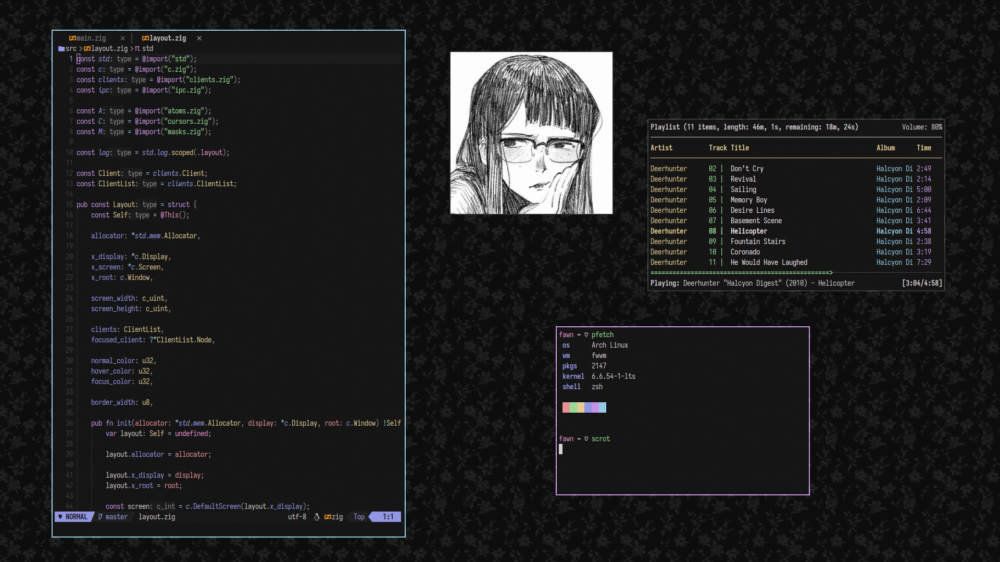

# fwwm

> fire walk with me

KISS floating x11 window manager fueled by coffee and cherry pies.

fwwm can be controlled with [cherry](cherry).

## why

i saw the abbreviation of David Lynch’s film [Twin Peaks: Fire Walk with
Me](https://letterboxd.com/film/twin-peaks-fire-walk-with-me) (fw**wm**) and it reminded me of window managers so i made
one. :)

although functional, this is mostly a toy project and there are far better options out there. i’m just learning more
about x11 and window managers in general.

## license

[Apache-2.0](LICENSE)
