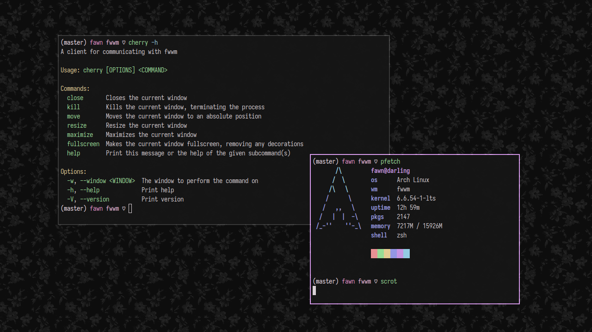

# cherry

A client for communicating with [fwwm](..)

same functionality as [bspc](https://github.com/baskerville/bspwm), works exactly like [berryc](https://berrywm.org)

# license

[Apache-2.0](../LICENSE)
